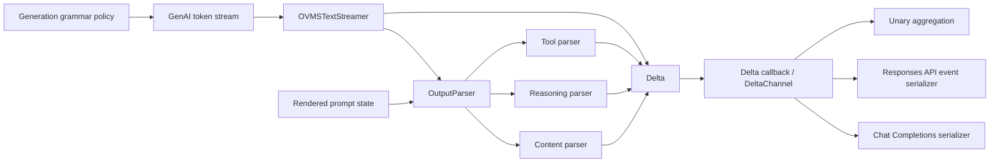

# Gemmamonster Internal Delta Event Model

Status: architecture contract for the 2026.4 stable refit

Authority snapshot:

- upstream 2026.4 source base: `9eb93f15fecb848d399f17c7a6a6626e5a1498d7`
- inspected refit HEAD before this document: `dc668c1667a58c3a399a76e3df5c7678b8cdcc80`
- accepted protocol provenance used by the refit: `fde0762ba314dc5f6448726dfce7c533bad9a8a6`

This document defines the internal event boundary introduced by the Gemmamonster refit. It is intentionally narrower than the public OpenAI API contracts and broader than Gemma 4 alone. The purpose is to make ownership explicit so parser state, stream transport, and endpoint serialization do not collapse back into one accidental state machine.

## 1. Architectural decision

The internal representation of generated output is a typed event stream:

```cpp
using Delta = std::variant<
    ContentDelta,
    ReasoningDelta,
    ToolCallDelta,
    FinishDelta,
    AudioDelta>;
```

The authoritative type definition is:

`src/llm/io_processing/delta.hpp`

A parser does **not** own Chat Completions JSON, Responses API SSE events, HTTP framing, or client-visible lifecycle sequencing. A parser owns semantic interpretation of model output and emits typed `Delta` values.

Endpoint handlers do **not** interpret Gemma 4 protocol tokens. They consume typed deltas and own conversion into their public API shape.

`OVMSTextStreamer` does **not** own tool-call semantics. It owns token decoding, special-token preservation at parser phase boundaries, parser invocation, and delivery of the produced deltas.

This split is the core rule. Violating it recreates the old class of failures where a tokenizer detail, parser boundary, and OpenAI JSON field become one inseparable bug.

## 2. Data flow



`AudioDelta` follows the same transport/event representation but belongs to the omni/audio path, not to Gemma 4 tool-calling semantics.

## 3. Event types

### 3.1 `ContentDelta`

```cpp
struct ContentDelta {
    std::string text;
};
```

Meaning: assistant-visible natural-language output that is neither reasoning nor a tool-call payload.

Semantic owner: content parsing path / `OutputParser` routing.

Public emitters:

- Chat Completions: assistant `content` delta.
- Responses API: `response.output_text.delta` and the corresponding output-item lifecycle.

A `ContentDelta` must never contain Gemma 4 tool boundary tokens or reasoning-channel boundary tokens after those phases have been recognized.

### 3.2 `ReasoningDelta`

```cpp
struct ReasoningDelta {
    std::string text;
};
```

Meaning: model reasoning text after model-native reasoning boundary handling.

Semantic owner: model-specific reasoning parser, for Gemma 4:

- `src/llm/io_processing/gemma4/gemma4_reasoning_parser.hpp`
- `src/llm/io_processing/gemma4/gemma4_reasoning_parser.cpp`

Public emitters:

- Chat Completions: reasoning-specific field/chunk according to that endpoint contract.
- Responses API: reasoning output-item / summary lifecycle and `response.reasoning_summary_text.delta`.

The reasoning parser may terminate reasoning when a tool-start boundary is observed. It does not serialize the resulting tool call.

### 3.3 `ToolCallDelta`

```cpp
struct ToolCallDelta {
    int index;
    std::optional<std::string> id;
    std::optional<std::string> name;
    std::string arguments;
};
```

Meaning: one incremental event belonging to a logical tool call identified by `index`.

Semantic owner: model-specific tool parser, for Gemma 4:

- `src/llm/io_processing/gemma4/gemma4_tool_parser.hpp`
- `src/llm/io_processing/gemma4/gemma4_tool_parser.cpp`

Gemma 4 tool-parser ownership includes the raw protocol boundary:

`<|tool_call> ... <tool_call|>`

The generic orchestrator must not independently strip or reinterpret that same boundary once parser ownership is configured.

`id` and `name` are present on the first delta for a logical tool-call index. Argument continuation deltas carry the same index with incremental `arguments` and normally omit `id`/`name`.

The `index` is the stable correlation key inside one generated response. Repeated calls to the same function name are distinct tool calls and therefore receive distinct indices. Tool identity must never be inferred from the function name.

Public emitters:

- Chat Completions: indexed `tool_calls[]` streaming deltas.
- Responses API: a `function_call` output item plus incremental `response.function_call_arguments.delta` events.

### 3.4 `FinishDelta`

```cpp
struct FinishDelta {};
```

Meaning: generation ended on a token that is intentionally swallowed by parsing, but the caller still needs a completion/finalization signal.

Semantic owner: parser/stream integration.

Public emitter owner: endpoint serializer, which combines finish state with `GenerationFinishReason` and emits the endpoint-specific terminal chunk/events.

`FinishDelta` carries no public API semantics by itself. In particular, it does not decide whether the final reason is `stop`, `length`, `tool_calls`, or an endpoint-specific equivalent.

### 3.5 `AudioDelta`

```cpp
struct AudioDelta {
    std::string base64;
};
```

Meaning: base64 PCM16 audio payload in the omni/audio path.

It is deliberately part of the same event algebra so transport and endpoint dispatch can remain type-safe. It is not part of the Gemma 4 parser contract and must not be made a dependency of Gemma 4-specific code.

## 4. Owners

The word **owner** means the component with final authority over one class of state or one transformation. More than one owner for the same fact is a bug farm.

| Concern | Owner | Must not be owned by |
|---|---|---|
| Model protocol grammar | model-specific parser/generation builder | HTTP/API serializer |
| Reasoning start/end interpretation | reasoning parser + generic phase orchestrator | Chat/Responses handler |
| Gemma 4 tool boundary interpretation | Gemma 4 tool parser | endpoint serializer |
| Parser phase lifecycle | `OutputParser` | endpoint serializer |
| Partial boundary buffering | `OutputParser::StreamOutputCache` and streamer boundary seam | API handler |
| Token decode mode / special-token visibility | `OVMSTextStreamer` + parser config | tool parser JSON serializer |
| Typed semantic output | parser returns `Delta` | raw HTTP layer |
| Tool-call correlation | `ToolCallDelta.index` during parsing; endpoint state mirrors it | function name |
| Public Chat Completions JSON | Chat Completions handler | parser |
| Public Responses SSE lifecycle | `OpenAIResponsesHandler` | parser/streamer |
| Responses `sequence_number` | `OpenAIResponsesHandler::responsesState` | parser |
| Rendered-prompt grammar reconciliation | `ChatTemplateProcessor` / template adapter | streamer |
| Persistent GenAI chat/session continuity | `LLMServable` session state | parser |
| Runtime provenance/profile selection | Gemmamonster runtime-profile tooling | parser |

## 5. Emitters

There are three different meanings of “emitter” in the refit and they must remain distinguished.

### 5.1 Semantic emitters

`BaseOutputParser::parseChunk()` and its model-specific implementations emit `std::optional<Delta>`.

They emit semantic events, not wire-format responses.

### 5.2 Stream transport emitter

`OVMSTextStreamer` is the transport emitter between generation and request handling. Its responsibilities are:

1. receive token IDs from GenAI;
2. choose decode visibility for special tokens according to active parser phase;
3. preserve special-token phase boundaries, including token-ID-recognized starts;
4. invoke `OutputParser`;
5. forward produced `Delta` values through the callback / delta channel;
6. provide the final drain call so bytes buffered across a phase transition are not lost.

It must not synthesize OpenAI JSON fields.

### 5.3 Public API emitters

The OpenAI handlers are wire-format emitters.

Chat Completions owns Chat Completions chunk layout, tool-call array indexing, finish fields, and unary aggregation.

Responses API owns the Responses lifecycle state machine. Its emitter state includes, at minimum:

- `sequenceNumber`;
- reasoning initialized/completed state;
- message initialized state;
- accumulated reasoning text;
- accumulated output text;
- per-index tool-call accumulation;
- created/in-progress lifecycle flags.

The Responses serializer converts one internal `ToolCallDelta` stream into events such as:

- `response.output_item.added` with `type=function_call`;
- `response.function_call_arguments.delta`;
- `response.function_call_arguments.done`;
- `response.output_item.done`.

It converts `ReasoningDelta` into the reasoning summary lifecycle and `ContentDelta` into the message/content lifecycle.

This lifecycle is endpoint state. It must not be pushed down into Gemma 4 parser state.

## 6. Phase model

`OutputParser` currently exposes the following processing phases:

```text
UNKNOWN
CONTENT
REASONING
TOOL_CALLS_PROCESSING_TOOL
TOOL_CALLS_WAITING_FOR_TOOL
```

The phase orchestrator owns routing and buffering. Model-specific parsers declare their boundaries through `OutputParsingConfig` and own interpretation inside their phase.

Important Gemma 4 refinement: ownership of a tool-call delimiter may be assigned to the tool parser itself. Generic routing must respect `parserOwnsStartTag` / corresponding parser configuration rather than stripping the delimiter twice.

Reasoning-to-tool handoff is a first-class transition. When Gemma 4 produces a tool opener while reasoning is active, the reasoning phase must terminate without losing the reasoning prefix or the tool opener, even when the boundary is split across decoder chunks.

## 7. Prompt state is an input to the event machine, not an event

The rendered Jinja prompt may already leave the model inside a reasoning channel. That state is detected after rendering and affects both parser initialization and hard generation grammar.

It is deliberately **not** represented as a `Delta` because no model output has happened yet.

Ownership:

- template analyzer/caps determine template capabilities;
- `ChatTemplateProcessor` sees the rendered prompt;
- prompt-state grammar adaptation reconciles pre-render generation policy with the actual rendered continuation state;
- `OutputParser::detectAndSetImplicitReasoningStart()` initializes parser phase expectations.

This avoids the duplicate-opener failure where a hard tool grammar demands a reasoning opener that the rendered prompt has already emitted.

## 8. Repeated and parallel tool calls

The event model treats tool-call position as identity.

Correct:

```text
index=0 name=search id=A arguments=...
index=1 name=search id=B arguments=...
```

Incorrect:

```text
name=search -> reuse previous call state
```

Therefore repeated same-tool calls and parallel distinct-tool calls use the same event machinery. `parallel_tool_calls` controls generation policy, not event identity.

When parallel calls are disabled, the generation grammar is responsible for preventing a second call. The parser and serializers should still remain structurally capable of representing multiple indices, because parsing must not silently alias or corrupt unexpected output.

## 9. Unary path

Unary and streaming responses must share semantic parsing.

The preferred flow is:

```text
model output
  -> parser
  -> vector<Delta>
  -> ParsedOutput aggregation where needed
  -> endpoint unary serializer
```

`ParsedOutput` is an aggregate view:

```cpp
struct ParsedOutput {
    std::string content;
    ToolCalls_t toolCalls;
    std::string reasoning;
};
```

It is not the streaming authority and must not become a second parser implementation.

## 10. State boundaries and reset requirements

Every request/generation must start with clean parser and endpoint emission state.

Required resets include:

- `OutputParser.processingPhase`;
- `OutputParser.streamOutputCache`;
- implicit reasoning state;
- model-specific parser internal buffers/state;
- endpoint streaming accumulation state;
- per-response tool-call correlation state.

Persistent GenAI chat/session continuity is separate. It may preserve conversation/KV/session state across requests, but it must not preserve an unfinished parser phase or an endpoint SSE lifecycle from the previous response.

## 11. Fault domains

The refit intentionally separates the following fault domains:

1. **Generation grammar fault**: model is allowed/forced to emit the wrong protocol sequence.
2. **Template-state fault**: rendered prompt and grammar disagree about the current channel.
3. **Decode fault**: special tokens needed for phase recognition are hidden or duplicated.
4. **Boundary-routing fault**: bytes around reasoning/tool transitions are lost, replayed, or routed twice.
5. **Tool-parser fault**: arguments, nesting, numbers, strings, recovery, or tool identity are parsed incorrectly.
6. **Correlation fault**: repeated/parallel calls are merged because name is treated as identity.
7. **Wire-emission fault**: correct `Delta` sequence is serialized into invalid Chat/Responses output.
8. **Session-continuity fault**: correct one-turn output fails on the next request because chat/KV/session ownership is wrong.
9. **Runtime provenance fault**: source contracts are tested against a different OpenVINO/GenAI runtime than the selected stable profile.

A test failure should be classified into one of these domains before code changes are made.

## 12. Required invariants

The following are architecture invariants, not implementation preferences:

1. Model-specific protocol knowledge stays below `Delta`.
2. Endpoint-specific JSON/SSE knowledge stays above `Delta`.
3. One logical tool call has one stable `index` for its entire delta sequence.
4. Function name is never a tool-call identity key.
5. Boundary bytes are either parser-owned or orchestrator-owned, never both.
6. A reasoning-to-tool transition cannot discard the reasoning prefix or tool opener.
7. Partial special-token boundaries can be buffered across chunks.
8. The final drain path must flush data retained after a phase transition.
9. Prompt state can adapt generation/parser setup before model output but cannot fabricate output deltas.
10. Endpoint lifecycle state resets per response even when the underlying GenAI session persists.
11. `parallel_tool_calls` changes generation policy, not the fundamental event representation.
12. A parser must be testable by asserting `Delta` sequences without running an HTTP server.
13. A serializer must be testable with synthetic `Delta` sequences without running a real model.

## 13. Contract tests implied by the model

At minimum, source-level and runtime acceptance should cover:

- content-only delta sequence;
- reasoning-only and reasoning-to-content transitions;
- reasoning-to-tool transition in one chunk;
- every byte split of the Gemma 4 tool opener;
- tool name/id emitted once, arguments incrementally;
- repeated same-tool calls with distinct indices and IDs;
- distinct parallel tool calls;
- malformed tool payload fail-closed behaviour;
- finish on swallowed special token;
- final buffer drain after a phase transition;
- Chat Completions serialization from synthetic tool deltas;
- Responses API lifecycle ordering from synthetic reasoning/content/tool deltas;
- response-state reset between requests;
- persistent session continuity without parser/emitter state leakage.

## 14. Known documentation debt discovered while defining this contract

`src/llm/io_processing/output_parser.hpp` still contains comments describing parser output as “JSON delta (OpenAI streaming format)”. The actual interface is `std::optional<Delta>` and the public JSON is produced later by endpoint handlers.

Those comments are stale and should be corrected. The code already follows the typed-event model more closely than that older prose suggests.

## 15. Consequence for future forward ports

When rebasing Gemmamonster onto a later OVMS release, compare layers independently:

```text
GenAI/runtime
prompt/template adaptation
generation grammar
special-token decode seam
phase orchestrator
model-native reasoning parser
model-native tool parser
Delta event algebra
Chat Completions emitter
Responses API emitter
persistent session owner
runtime provenance/package tooling
```

A newer upstream implementation should replace a refit layer only when its ownership contract and acceptance behaviour are equivalent or stronger. Version number alone is not an architectural argument.
